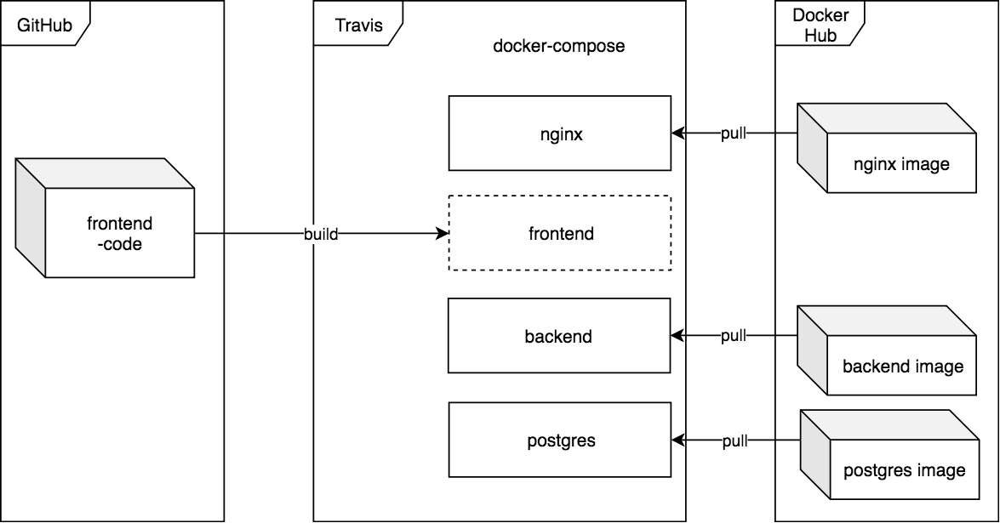

[](https://travis-ci.org/ohtuprojekti-ilmo/ohtuilmo-frontend)

# ohtuilmo

Registration, administration and review tool for University of Helsinki's software engineering project course.

- [Backend](https://github.com/ohtuprojekti-ilmo/ohtuilmo-backend)

## Table of Contents

* [Development](#development)
    * [Local development](#local-development)
    * [Test users](#test-users)
    * [Accessing the database](#accessing-the-database)
        * [Directly with psql](#directly-with-psql)
        * [With the dbscript](#with-the-dbscript)
    * [Writing and running tests locally](#writing-and-running-tests-locally)
        * [Writing tests](#writing-tests)
        * [If you're writing a frontend-only feature which works with the Docker image in DockerHub](#if-youre-writing-a-frontend-only-feature-which-works-with-the-docker-image-in-dockerhub)
        * [If you're writing a feature that touches both the frontend and backend](#if-youre-writing-a-feature-that-touches-both-the-frontend-and-backend)
    * [Running end-to-end tests](#running-end-to-end-tests)
* [CI, Docker](#ci-docker)
    * [Available tags](#available-tags)
* [Deployment: staging and production](#deployment-staging-and-production)
* [Design compromises and things we didn't have time to fix](#design-compromises-and-things-we-didnt-have-time-to-fix)
* [Docker cheatsheet](#docker-cheatsheet)

## Development

### Local development

1. Install docker, docker-compose and node.
2. Clone this repo and the [backend](https://github.com/ohtuprojekti-ilmo/ohtuilmo-backend) repo under the same directory.
    ```
    ohtuprojekti-ilmo/
    ├── ohtuilmo-backend/
    └── ohtuilmo-frontend/
    ```
3. Copy the `docker-compose.sample.yml` file into this project root directory, rename it to `docker-compose.yml`.
    - Notice that the docker-compose file specifies `ohtuilmo-backend` and `ohtuilmo-frontend` as the directory names for backend's and frontend's `build` dir
    ```
    ohtuprojekti-ilmo/
    ├── ohtuilmo-backend/
    ├── ohtuilmo-frontend/
    └── docker-compose.yml
    ```
4. Run `npm install` in both backend's and frontend's directory
5. Start the database with `docker-compose up -d db`
    - If the command fails, saying that port 5432 is already bound, change or remove the host port in the docker-compose file:
        ```yml
        db:
        # ...
        ports:
            - '5432:5432'
            #  ↑
            #  └ host port
        ```
6. Create, migrate and seed the database
    ```sh
    $ cd ohtuilmo-backend
    $ npm run db:recreate
    ```
7. Start the backend and frontend in watch mode
    - backend: `npm run watch`
    - frontend: `npm start`

### Test users

| Username      | Password        |
|---------------|-----------------|
| testertester  | testertester123 |
| testertester2 | testertester123 |
| testertester3 | testertester123 |

### Accessing the database

#### Directly with psql

By default, the `docker-compose.sample.yml` file exposes the PostgreSQL 10.6 server on your localhost port 5432. You can directly connect to the database with the PostgreSQL client `psql`.
- MacOS: `brew install postgres`
- Linux: `sudo apt-get install postgresql-client`
- Windows: good luck

```sh
$ psql postgres://postgres@localhost:5432/dev_postgres
#                    ↑                 ↑       ↑
#        db username ┘       host port ┘       └  db name, depends on
#                                                 backend's NODE_ENV
```

The name of the database (here `dev_postgres`) depends on backend's `NODE_ENV`. As to why it's `postgres`, see [_Design compromises and things we didn't have time to fix_](#design-compromises-and-things-we-didnt-have-time-to-fix).

| NODE_ENV    | db created by `npm run db:recreate` |
|-------------|-------------------------------------|
| production  | postgres                            |
| development | dev_postgres                        |

#### With the dbscript

The dbscript was originally written to compare the schema created by Sequelize to that created by the migrations. (diff files created by `drop-init-sequelize` and `drop-init-migrations`). However, it's also a handy tool to run SQL commands in the container. Note: the current version expects the db to be exposed on host port 5432.

Copy the `dbscript.sh` to the project root directory (same directory as `docker-compose.yml`), chmod +x it if not already, and run it. Make sure your current working directory is the same directory.
- ```
  ohtuprojekti-ilmo/
  ├── ohtuilmo-backend/
  ├── ohtuilmo-frontend/
  ├── dbscript.sh
  └── docker-compose.yml
  ```

Help:

```
user:~/ohtuprojekti-ilmo$ ./dbscript

./dbscript.sh [COMMAND]
where COMMAND is one of the following:
    drop-init-sequelize    Backs up db, clears database, then
                           initializes it by running backend and
                           allowing Sequelize to sync().

    drop-init-migrations   Backs up db, clears database, then
                           initializes it by running the db:migrate.

    drop-init-both         Backs up db, clears database, then
                           initializes it by first running db:migrate,
                           then allows Sequelize to sync().

    nuke-db                Backs up db, then DROPs the database and
                           CREATEs it.

    dump-db                Backs up the db to file.

    run-file [filename]    Runs a PSQL file on the database. Use to
                           restore database backups.

    run <SQL>              Run an SQL statement on the db.

```

After everything is running, try this for example:

```sh
$ ./dbscript.sh run '\d users'
$ ./dbscript.sh run 'select * from users'
```

To change the name of the database (by default `dev_postgres`), edit the script.

### Writing and running tests locally

This project uses [Cypress](https://www.cypress.io/) for browser testing.

The frontend's `e2e/` directory contains the test specs and a custom docker-compose file (`docker-compose.e2e.yml`) which can be used to set up an environment which  matches the actual production environment. See [_Running end-to-end tests_](#running-end-to-end-tests).

#### Writing tests

The test specs can be found in `e2e/cypress/integration`.

#### If you're writing a frontend-only feature which works with the Docker image in DockerHub

In this case, you can just start the backend using the DockerHub image.

1. Start `db` and `backend` with docker-compose normally, no need to specifically use the `.e2e.yml` file.
2. Check which port the backend is running on
    - In frontend's `package.json`, set `"proxy": "http://localhost:<PORT>"` to the correct port so that the frontend's /api calls get proxied to the backend
        - Probably easiest if you use the port found in the file as the host port in docker-compose.
        - Don't commit this change, it's not needed in production and it changes per developer really.
3. Start the frontend with `npm start`
4. Run Cypress. Check which port the frontend is running on, pass it to Cypress before opening it
    - There's [multiple ways](https://docs.cypress.io/guides/guides/environment-variables.html#Setting) to pass this information to Cypress, the easiest for you probably is to do:
        ```sh
        CYPRESS_baseUrl=http://localhost:<PORT> npm run cypress:open
        ```
        or
        ```
        npm run cypress:open -- --env CYPRESS_baseUrl=http://localhost:<PORT>
        ```
        The `baseUrl` lets Cypress know which host to direct its requests when we do `cy.visit('/')`. Alternatively

#### If you're writing a feature that touches both the frontend and backend

Same instructions as above but you only start `db` with docker-compose.

### Running end-to-end tests

The full E2E test suite can be run locally, but notice that it builds the frontend image from the frontend directory, meaning that you can't interactively edit your code and the tests.

Run:
- `npm run e2e:install`
- `npm run e2e:setup`
- `npm run e2e:run or npm run e2e:open`
- `npm run e2e:teardown`

The E2E tests set up nginx, backend, frontend and the database with docker-compose, then run the Cypress tests using nginx's port.

## CI, Docker

When pushing to a branch, Travis runs the Cypress e2e tests. When running in CI, Cypress screenshots of failing tests and video of all tests. These are submitted to the Cypress Dashboard. The project is public in the dashboard, but the dashboard still requires login (just login with Github and it'll work).

Travis will build the frontend image, and pull all other images.



- Travis:
    - [Frontend](https://travis-ci.org/ohtuprojekti-ilmo/ohtuilmo-frontend)
    - [Backend](https://travis-ci.org/ohtuprojekti-ilmo/ohtuilmo-backend)
- [Cypress Dashboard](https://dashboard.cypress.io/#/projects/27w3df/runs)

After a commit has been pushed to master and Travis has cleared the tests, it will build and push a new Docker image to DockerHub. These images are used in staging and production via `docker-compose pull`.

- DockerHub
    - [Frontend](https://hub.docker.com/r/ohtuprojektiilmo/ohtufront)
    - [Backend](https://hub.docker.com/r/ohtuprojektiilmo/ohtufront)

### Available tags

For both frontend and backend, the `latest` tag is built from the latest commit on master which has passed the Travis tests. Additionally, each of these builds are tagged with the short commit hash, allowing manual rollbacks in production by changing the tag in the docker-compose file. 

## Deployment: staging and production

The staging and production servers run on the University of Helsinki's CS department's servers. The production server is public at `https://studies.cs.helsinki.fi/projekti`, but the staging server is behind the CS department's internal network's firewall. Connect via melkki or melkinkari etc.

Both services are behind a reverse proxy (nginx). It proxies `/projekti` to the frontend and `/projekti/api` to the backend. See the [`e2e-nginx` image's nginx.conf](https://github.com/ohtuprojekti-ilmo/e2e-nginx/blob/master/nginx.conf) for a sample.

Assuming you've been given proper ssh access, you can deploy new images from DockerHub with the `deploy.sh` script found in the correct user's home directory.

`deploy.sh`:
```sh
#!/bin/bash
set -e

# Pull latest images from DockerHub
docker-compose pull frontend backend

# Make sure db is up
docker-compose up -d db

# Stop frontend and backend so we can restart with new images
docker-compose stop frontend backend

# Run possible migrations
docker-compose run --entrypoint 'npm run db:migrate' backend

# Bring services back uo
docker-compose up -d backend frontend
```


## Design compromises and things we didn't have time to fix

See [issues marked with tag `design-compromise`](https://github.com/ohtuprojekti-ilmo/ohtuilmo-frontend/issues?q=is%3Aissue+is%3Aopen+label%3Adesign-compromise).


## Docker cheatsheet

[Docker cheatsheet](https://github.com/jexniemi/Docker-cheat-page/wiki)


